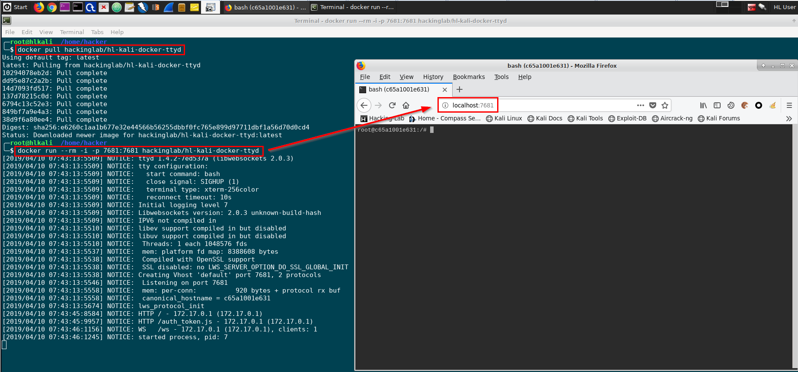

# Docker Keycloak IdP and Traefik Workshop
## Introduction
I am a part-time cyber security lecturer at the software engineering department of the University of Applied Science in Rapperswil Switzerland. My students must learn several programming skills and in almost any web software project some sort of authentication and authorization must be applied. I want my students to spend their time working on the real purpose of the software problem (problem domain), instead of spending hours with authentication and authorization. Needless to say this is a crucial task in a real software project. Read this tutorial and I will show you how to add authentication to any web service that does not have a builtin authentication layer using keycloak IdP and keycloak proxy. 

## Sample Docker Application that comes *without* Authentication
For the sake of this tutorial I have chosen a ttyd Docker image (appliation), a service that will provide a web shell to a kali linux machine. The ttyd sample application is not asking for username and password. It provides a `bash` shell for the user. You can grab the ttyd docker source from GitHub https://github.com/ibuetler/e1pub/tree/master/docker/hl-kali-docker-ttyd or pull the image from Docker Hub. I will pull and run the docker image below, as this tutorial is not about "how to create docker images". The web port is listening on port 7681. 

```
docker pull hackinglab/hl-kali-docker-ttyd
docker run --rm -i -p 7681:7681 hackinglab/hl-kali-docker-ttyd
CTRL+C will stop the docker 
```
Below: Sceenshot Firefox is visiting http://localhost:7681



Please give it a try! I am doing this demo using the latest Hacking-Lab LiveCD from https://livecd.hacking-lab.com/, as the OVA has docker and everything already configured and works like charm.  

## Traefik
I run all my docker services ‘behind’ traefik (https://traefik.io/). I do not want to have my (hundreds of) docker services directly accessible from the Internet (security). I do not want to create and handle SSL/TLS certificates for all the docker services. In production; I am using an SSL wildcard certificate and point it to my traefik ip address. In development; Traefik is automatically creating self-signed certificates for me. This is what we want in this tutorial. 


Traefik terminates TLS/SSL and routes everything, based on HOST or URL pattern rules, to the designated docker-based and on-demand back-end service. Furthermore, traefik is docker-aware and allows registering or unregistering docker services without restarting traefik. 

Traefik itself must be assigned to every shared docker transit network, before it can exchange data with it. 

### Pull Traefik Docker
a


## Keycloak IdP (Identity Provider)
For the sake of this tutorial I use keycloak, an open-source identity provider that runs smoothly with docker. If you don’t know keycloak, I encourage you to get into this project. It is the open source version of the RedHat RH-SSO solution. 

Please setup keycloak using the following commands
```
mkdir /opt/git
git clone https://github.com/ibuetler/e1pub.git
cd /opt/git/e1pub/docker/keycloak-idp-docker
mkdir -p /opt/data/keycloak/postgres/data/

```
