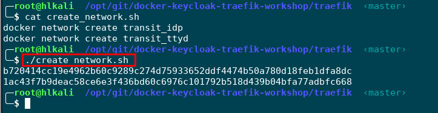

# Docker Keycloak IdP and Traefik Workshop
## Introduction
I am a part-time cyber security lecturer at the software engineering department of the University of Applied Science in Rapperswil Switzerland. My students must learn several programming skills and in almost any web software project some sort of authentication and authorization must be applied. I want my students to spend their time working on the real purpose of the software problem (problem domain), instead of spending hours with authentication and authorization. Needless to say this is a crucial task in a real software project. Read this tutorial and I will show you how to add authentication to any web service that does not have a builtin authentication layer using keycloak IdP and keycloak proxy. 

## Sample Docker Application that comes *without* Authentication
For the sake of this tutorial I have chosen the ttyd Docker image we want to add authentication using Keycloak. The ttyd application provides web access `bash` to a kali linux machine. The ttyd sample application is not asking for a username and password. You can grab the ttyd docker source from GitHub https://github.com/ibuetler/e1pub/tree/master/docker/hl-kali-docker-ttyd or pull the image from Docker Hub. I will pull and run the docker image below, as this tutorial is not about "how to create docker images". The ttyd web port is listening on port `7681`. 

```
docker pull hackinglab/hl-kali-docker-ttyd
docker run --rm -i -p 7681:7681 hackinglab/hl-kali-docker-ttyd
CTRL+C will stop the docker 
```
See the screenshot below how to pull and run and test ttyd


Please give it a try! I am doing this demo using the latest Hacking-Lab LiveCD from https://livecd.hacking-lab.com/, as the LiveCD has docker and everything already configured and works like charm. If you want to use the Hacking-Lab LiveCD too, please follow the following installation instructions

https://github.com/ibuetler/e1pub/tree/master/hacking-lab-livecd-installation

Once you're good, please stop the docker in the same terminal you have executed "docker run..." by pressing CTRL-C. This will shutdown the ttyd docker service. It must be shutdown for the next steps. 


## Traefik Load Balancing Service
I run all my docker services `behind` traefik (https://traefik.io/). I do not want to have my (hundreds of) docker services, APIs, RESTful APIs and more directly accessible from the Internet (security). I do not want to create and handle SSL/TLS certificates for every single docker services. In production; I am using an SSL wildcard certificate or Let's Encrypt TLS and point it to the traefik ip address. In development; Traefik is automatically creating self-signed certificates for me. This is what we want in this tutorial. Needless to say, Traefik is a docker service too. 


Traefik terminates TLS/SSL and routes everything, based on HOST or URL pattern rules, to the designated docker-based and on-demand back-end service. Furthermore, traefik is docker-aware and allows registering or unregistering docker services without restarting traefik. 

Before we proceed with setting up our traefik docker, please pull the workshop github repo first. This will save you time as the traefik and all other docker-compose.yml files are ready for testing in the workshop repo. 


## Pull Workshop Github Repository
Please pull the workshop repo using the following commands. I have chosen `/opt/git/` as the base directory for this tutorial. Change it to whatever you like or prefer. 

```
mkdir -p /opt/git
cd /opt/git
git clone https://github.com/ibuetler/docker-keycloak-traefik-workshop.git
cd /opt/git/docker-keycloak-traefik-workshop/
ls -al 
```
The command `ls -al` is listing the directory of the workshop files. You should have multiple files and directories we need in this tutorial. 


### Step 1: Create Docker Transit Networks
Traefik itself must be assigned to every docker network it will route packages to and from. The workshop demo is based on a docker network between Traefik and the IdP (Keycloak) and another docker network between Traefik and our sample application (ttyd). The following commands will create the transit_idp and transit_ttyd networks for you. 

```
cd /opt/git/docker-keycloak-traefik-workshop/traefik
bash create_network.sh
```



This will create the transit networks for you. If you don't want to run the script, you can run the commands manually

```
docker network create transit_idp
docker network create transit_ttyd
```

### Step 2: Run Traefik
Next we want to run the traefik service. There is a docker-compose.yml available. Please follow the instructions below. This will pull the traefik image and starts traefik in daemon mode. Using the command `docker-compose logs -f`, you can see the traefik service log which is set to DEBUG.  

```
cd /opt/git/docker-keycloak-traefik-workshop/traefik
docker-compose up -d 
docker-compose logs -f
```


### Step 3: Run ttyd together with Traefik
You should have tested ttyd in `Step 1` and Traefik should be up and running in `Step 2`. Time to test, how to connect these two docker services together. Please open a new root terminal. 

The commands below will start the ttyd docker and is registering the ttyd service to traefik. The magic is within the traefik labels of the `docker-compose.yml` file. Please make sure your traefik service is still running from `Step 2`

```
cd /opt/git/docker-keycloak-traefik-workshop/ttyd
docker-compose up 
```


## Keycloak IdP (Identity Provider)
For the sake of this tutorial I use keycloak, an open-source identity provider that runs smoothly with docker. If you don’t know keycloak, I encourage you to get into this project. It is the open source version of the RedHat RH-SSO solution. 

Please setup keycloak using the following commands
```
mkdir /opt/git
git clone https://github.com/ibuetler/e1pub.git
cd /opt/git/e1pub/docker/keycloak-idp-docker
mkdir -p /opt/data/keycloak/postgres/data/

```
